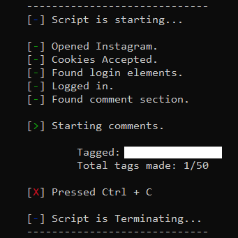
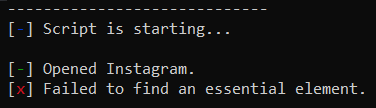

# Instagram Bot (v1.1)

Last changes: 05/11/2024

## HOW CODES WORK

accounts.py

1. Create account automatically with the given information
2. Instagram has daily limit to 2-3 accounts creation so you may experience problems

comments.py

1. Connects in your account and comments on the given giveaway
2. The comments are done in a random time to avoid ban
3. You better add more names to tag on the comments

## STEPS

1. Remove all the files from the .zip file into a new file
2. Complete the information needed in the InfoTag.ini or the InfoAccount.ini files
3. Download Chrome Browser and [Python](https://phoenixnap.com/kb/how-to-install-python-3-windows)
4. Go to the file created in Step 1
5. Open the terminal(cmd) using right click on the file
6. If everything was completed, go to step 7
7. `pip install -r requirements.txt`
8. `pip install --upgrade -r requirements.txt`
9. `python3 comments.py` or `python3 accounts.py`
10. Keep the terminal open while the program is running
11. Use Ctrl + C to end the program on the terminal

## ATTENTION

1. It may not run in the first attempts
2. You have to remove 2 factor authentication on your account before you run the program
3. Instagram has a daily comment limit, so for safety the programm will do around 50
4. After you put the verification code, it may freeze. Close the tab and open a new with your created account

## EXAMPLES

## PROBLEMS (trying to fix)

If you see this message just run the script a few times until it works

